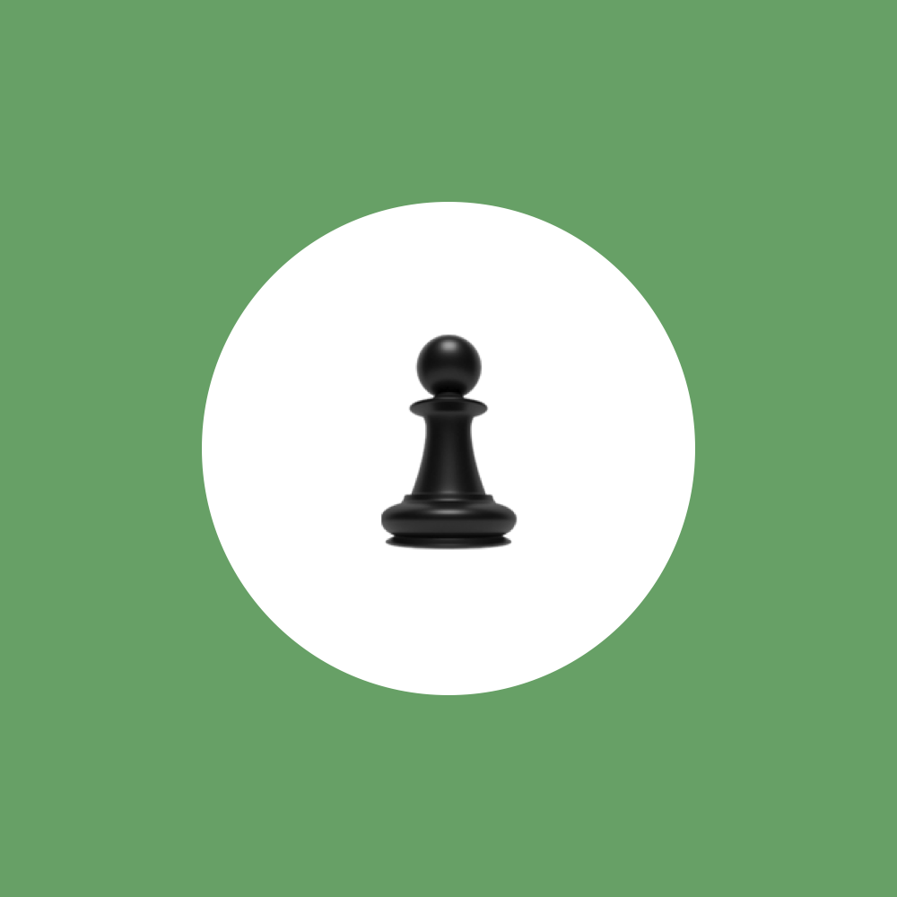

# Chess.com Profile Plugin for Micro.blog

A simple Micro.blog plugin that displays your Chess.com profile with ratings and a challenge button using the Chess.com public API.

## Features

Displays your Chess.com avatar, username, title, current ratings, and a customizable challenge button.



## Installation

Install from the Micro.blog plugins page.

## Configuration

The plugin requires your Chess.com username and optionally allows you to customize the challenge button text.

## Usage

Add the shortcode anywhere in your blog posts or pages:

```

```

You can also override the username for a specific instance:

```

```

## Support & Donate

**Plugin questions:** [GitHub Issues](https://github.com/mattlangford/Chess.com-for-Micro.blog/issues)  
**Micro.blog help:** [help.micro.blog](https://help.micro.blog)  

**Support Development:**
- [GitHub Sponsors](https://github.com/sponsors/mattslangford)
- [Buy Me a Coffee](https://buymeacoffee.com/mattlangford)

## Version

1.0 - Initial release